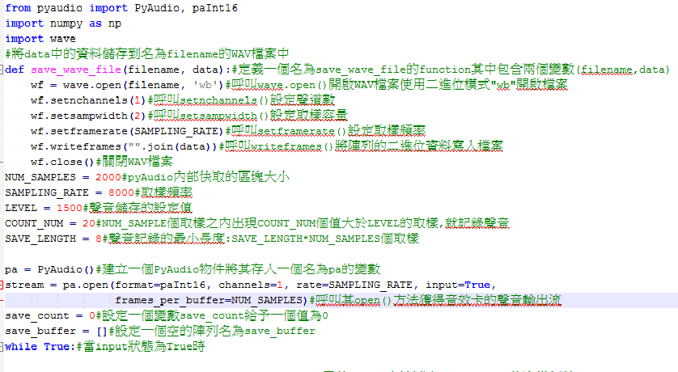
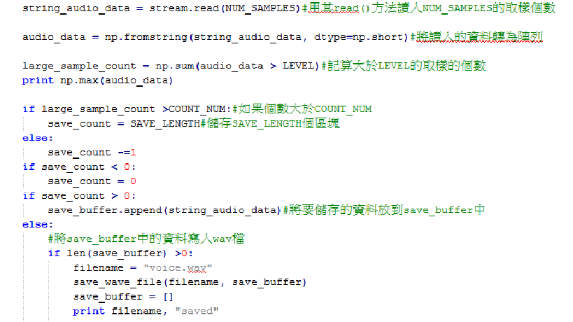
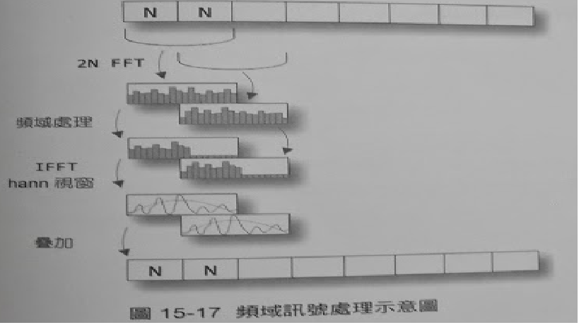

voice_change
============
voice_change是一個語音處理的程式,其主要目的是對頻域訊號進行壓縮或伸展,來改變對應的聲音訊號的音調.
其中包含一個主程式(main.py)和其他三個小的程式(pyaudio_record.py) (spectrum_frep_process.py) (spectrum_freq_scale.py)

pyaudio_record.py
-----------------
pyaudio_record.py主要是用來記錄使用者的聲音
程式中用一些全域變數來設定錄音參數:
以SAMPLING_RATE為採樣頻率,每次讀入一塊有NUM_SAMPLES個採樣的資料區塊,當讀入的採樣資料中有COUNT_NUM個值大於LEVEL時,
將資料儲存到WAV檔案中,一旦開始儲存資料,儲存的資料長度最短為SAVE_LENGTH個區塊.

 

 

spectrum_freq_process.py
------------------------
spectrum_freq_process.py訊號處理

 

 
從上圖得知
step1:首先將輸入訊號以每N個取樣訊號為一組進行分段,N為2的整數次冪
step2:以1/2的重疊率對2*N個取樣訊號進行FFT計算
step3:對FFT的計算結果進行頻域訊號處理
step4:用IFFT將處理後的頻域訊號轉為時域訊號
step5:將每段時域訊號都與2*N點的Hann視窗進行乘積運算
step6:將得到的時域訊號以1/2的重疊率進行疊加,得到處理後的時域訊號
這種處理演算法直接對訊號的頻譜進行修改,然後在透過IFFT轉為時域訊號,由於是分段計算,轉換後的訊號之間沒有很好的連續性,因此需要用1/2重疊率和Hann視窗在兩個訊號區之間進行平滑轉換
